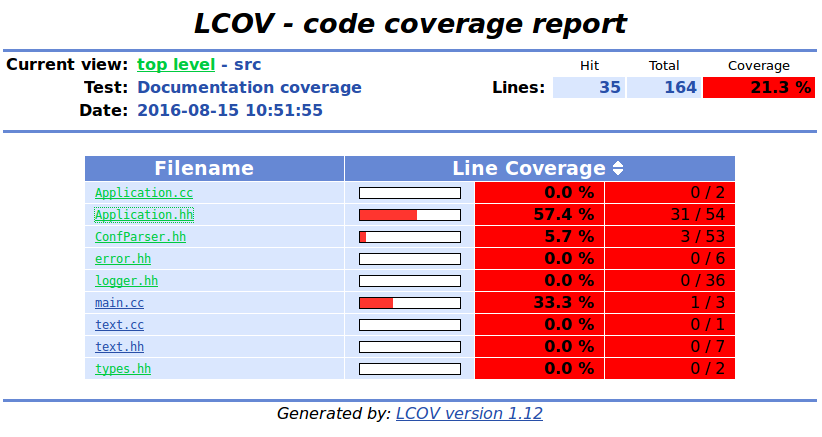
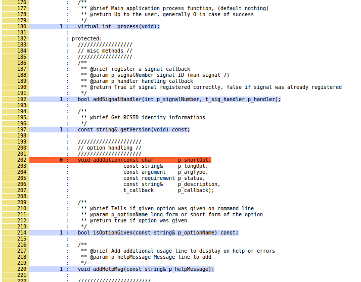

# Coverxygen


# Howto

First, run doxygen with XML output on your project, Coverxygen will read generated file and produce an lcov compiatible output.
Finally, run `lcov` or `genhtml` to produce the coverage output.

## Prerequistes

Coverxygen relies on both doxygen (to generate the documentation information) and lcov to generate the reports.
```bash
sudo apt-get install doxygen lcov
```

## Installation

```bash
pip3 install coverxygen
```

## Configure doxygen

Tell doxygen to generate an XML version of your doxyfile.cfg configuration
```
GENERATE_XML = YES
```

Then run doxygen
```bash
doxygen <path_to_your_doxygen.cfg>
```

## Run Coverxygen
```bash
covergygen --xml-path <path_to_doxygen_xml_dir> --output doc-coverage.info
```

## Run lcov or genhtml

If you want an simple console output :
```
lcov --summary doc-coverage.info
```

More interresting, produce a html-browsable coverage detail :
```bash
genhtml --no-function-coverage --no-branch-coverage doc-coverage.info -o .
# browse results in index.html
```

## Results

Summary



Details



# Credits
Special thanks to Alvaro Lopez Ortega <[alvaro@gnu.org](mailto:alvaro@gnu.org)> who found a smart and efficient solution get retreive doxygen informations from the generated xml.

You can find his work at [alobbs/doxy-coverage](https://github.com/alobbs/doxy-coverage)


# Project status

Unstable but usable.
[](https://badge.fury.io/py/coverxygen)

